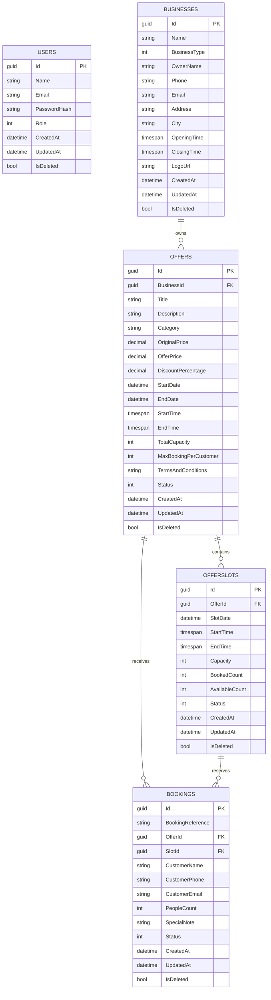

# Database Schema and ER Diagram

This document describes the database design for the Smart Offer Slot Booking System.

## Overview

The application uses 5 core tables:

- `Users`
- `Businesses`
- `Offers`
- `OfferSlots`
- `Bookings`

All entities inherit common base fields:

- `Id` (`Guid`, primary key)
- `CreatedAt` (`DateTime`)
- `UpdatedAt` (`DateTime?`)
- `IsDeleted` (`bool`, soft delete flag)

Soft delete is applied globally in Entity Framework using query filters, so rows marked with `IsDeleted = true` are excluded from normal reads.

## ER Diagram

## Table Details

### 1. `Users`

Purpose:
Stores application users such as admin, business, and customer roles.

Fields:

| Column | Type | Description |
|---|---|---|
| `Id` | `Guid` | Primary key |
| `Name` | `string` | Full name |
| `Email` | `string` | Login email |
| `PasswordHash` | `string` | Hashed password |
| `Role` | `UserRole` enum | `Customer`, `Business`, `Admin` |
| `CreatedAt` | `DateTime` | Record creation time |
| `UpdatedAt` | `DateTime?` | Last update time |
| `IsDeleted` | `bool` | Soft delete flag |

Notes:

- The current hackathon flow mainly uses the `Admin` role for dashboard access.

### 2. `Businesses`

Purpose:
Stores business profile information for the organization creating offers.

Fields:

| Column | Type | Description |
|---|---|---|
| `Id` | `Guid` | Primary key |
| `Name` | `string` | Business name |
| `BusinessType` | `BusinessType` enum | Business category |
| `OwnerName` | `string` | Owner or manager name |
| `Phone` | `string` | Business contact number |
| `Email` | `string` | Business contact email |
| `Address` | `string` | Street address |
| `City` | `string` | City |
| `OpeningTime` | `TimeSpan` | Daily opening time |
| `ClosingTime` | `TimeSpan` | Daily closing time |
| `LogoUrl` | `string?` | Optional logo image URL |
| `CreatedAt` | `DateTime` | Record creation time |
| `UpdatedAt` | `DateTime?` | Last update time |
| `IsDeleted` | `bool` | Soft delete flag |

Relationships:

- One `Business` can have many `Offers`

### 3. `Offers`

Purpose:
Stores time-bound promotional offers created by a business.

Fields:

| Column | Type | Description |
|---|---|---|
| `Id` | `Guid` | Primary key |
| `BusinessId` | `Guid` | Foreign key to `Businesses.Id` |
| `Title` | `string` | Offer title |
| `Description` | `string` | Offer details |
| `Category` | `string` | Offer category |
| `OriginalPrice` | `decimal` | Base price |
| `OfferPrice` | `decimal` | Discounted price |
| `DiscountPercentage` | `decimal` | Calculated discount |
| `StartDate` | `DateTime` | Offer start date |
| `EndDate` | `DateTime` | Offer end date |
| `StartTime` | `TimeSpan` | Daily start time |
| `EndTime` | `TimeSpan` | Daily end time |
| `TotalCapacity` | `int` | Total capacity assigned to the offer |
| `MaxBookingPerCustomer` | `int` | Limit per customer/phone number |
| `TermsAndConditions` | `string?` | Optional terms |
| `Status` | `OfferStatus` enum | `Draft`, `Active`, `Paused`, `Expired`, `Cancelled` |
| `CreatedAt` | `DateTime` | Record creation time |
| `UpdatedAt` | `DateTime?` | Last update time |
| `IsDeleted` | `bool` | Soft delete flag |

Relationships:

- Many `Offers` belong to one `Business`
- One `Offer` has many `OfferSlots`
- One `Offer` has many `Bookings`

### 4. `OfferSlots`

Purpose:
Stores the bookable time slots for each offer.

Fields:

| Column | Type | Description |
|---|---|---|
| `Id` | `Guid` | Primary key |
| `OfferId` | `Guid` | Foreign key to `Offers.Id` |
| `SlotDate` | `DateTime` | Slot date |
| `StartTime` | `TimeSpan` | Slot start time |
| `EndTime` | `TimeSpan` | Slot end time |
| `Capacity` | `int` | Slot capacity |
| `BookedCount` | `int` | Reserved quantity |
| `AvailableCount` | `int` | Remaining quantity |
| `Status` | `SlotStatus` enum | `Available`, `Full`, `Closed`, `Expired`, `Cancelled` |
| `CreatedAt` | `DateTime` | Record creation time |
| `UpdatedAt` | `DateTime?` | Last update time |
| `IsDeleted` | `bool` | Soft delete flag |

Relationships:

- Many `OfferSlots` belong to one `Offer`
- One `OfferSlot` has many `Bookings`

### 5. `Bookings`

Purpose:
Stores customer reservations for a selected offer slot.

Fields:

| Column | Type | Description |
|---|---|---|
| `Id` | `Guid` | Primary key |
| `BookingReference` | `string` | Unique public booking reference |
| `OfferId` | `Guid` | Foreign key to `Offers.Id` |
| `SlotId` | `Guid` | Foreign key to `OfferSlots.Id` |
| `CustomerName` | `string` | Customer name |
| `CustomerPhone` | `string` | Customer phone number |
| `CustomerEmail` | `string` | Customer email |
| `PeopleCount` | `int` | Number of seats/people booked |
| `SpecialNote` | `string?` | Optional note |
| `Status` | `BookingStatus` enum | `Pending`, `Confirmed`, `Cancelled`, `Completed`, `NoShow` |
| `CreatedAt` | `DateTime` | Record creation time |
| `UpdatedAt` | `DateTime?` | Last update time |
| `IsDeleted` | `bool` | Soft delete flag |

Relationships:

- Many `Bookings` belong to one `Offer`
- Many `Bookings` belong to one `OfferSlot`

## Enum Definitions

### `UserRole`

- `Customer = 0`
- `Business = 1`
- `Admin = 2`

### `OfferStatus`

- `Draft = 0`
- `Active = 1`
- `Paused = 2`
- `Expired = 3`
- `Cancelled = 4`

### `SlotStatus`

- `Available = 0`
- `Full = 1`
- `Closed = 2`
- `Expired = 3`
- `Cancelled = 4`

### `BookingStatus`

- `Pending = 0`
- `Confirmed = 1`
- `Cancelled = 2`
- `Completed = 3`
- `NoShow = 4`

### `BusinessType`

- `Restaurant = 0`
- `Salon = 1`
- `Fitness = 2`
- `Retail = 3`
- `Consulting = 4`
- `Other = 5`

## Relationship Summary

- `Business (1) -> (Many) Offers`
- `Offer (1) -> (Many) OfferSlots`
- `Offer (1) -> (Many) Bookings`
- `OfferSlot (1) -> (Many) Bookings`

## Business Logic Notes

- Offer price must be lower than original price
- Booking is blocked if offer is expired or inactive
- Booking is blocked if slot is full or inactive
- `BookedCount` and `AvailableCount` are updated after booking creation
- Booking limits are enforced using customer phone number and `MaxBookingPerCustomer`
- Soft-deleted rows are hidden automatically by global query filters

## Recommended Submission Use

You can include this file directly in your GitHub repository and also export the Mermaid ER diagram as an image for the hackathon submission if needed.
